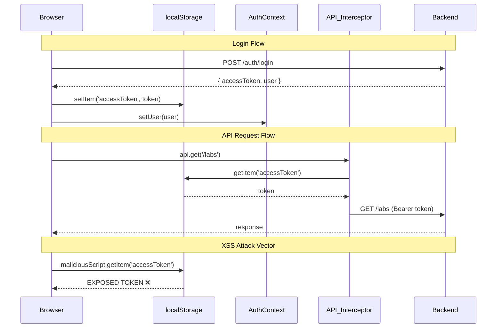
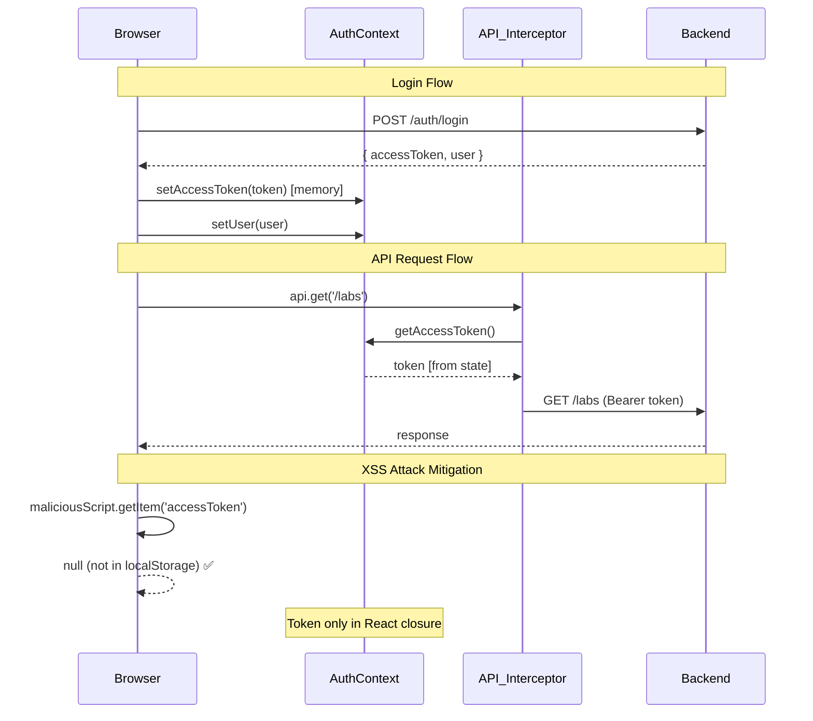
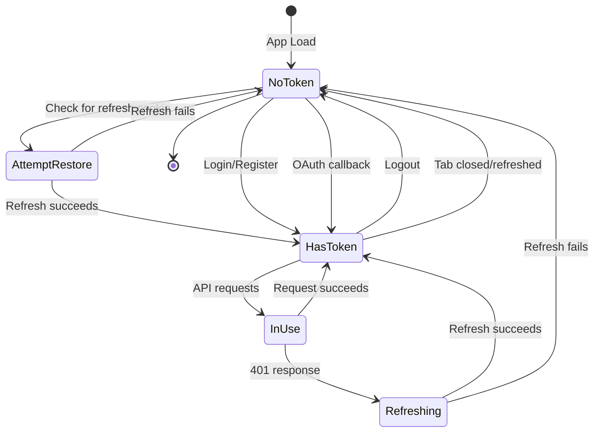

# Design Document: Access Token Memory Storage Security Fix

## Overview

This design addresses a critical XSS vulnerability in the Smart IT Lab authentication system by migrating access token storage from `localStorage` to in-memory React state. The current implementation stores the JWT access token in `localStorage`, making it accessible to any malicious script injected via XSS attacks. By moving the token to memory-only storage, we eliminate this attack vector while maintaining all existing authentication flows.

The refresh token correctly remains as an httpOnly cookie, which is already secure against XSS. This design focuses solely on securing the access token without disrupting the user experience or breaking existing functionality.

**Key Design Principles:**
- **Security First**: Access token never touches persistent storage
- **Zero User Impact**: Session persistence maintained via refresh token
- **Minimal Code Changes**: Surgical modifications to auth-context and api interceptor
- **Backward Compatible**: Graceful migration from localStorage-based tokens

## Architecture

### Current Architecture (Vulnerable)



### New Architecture (Secure)



### Token Flow Diagram



## Components and Interfaces

### 1. AuthContext Changes

**New State Variables:**
```typescript
const [accessToken, setAccessToken] = useState<string | null>(null);
```

**New Exported Functions:**
```typescript
interface AuthContextType {
  // ... existing fields ...
  getAccessToken: () => string | null;
  setAccessTokenInternal: (token: string | null) => void;
}
```

**Function Specifications:**

#### `getAccessToken()`
- **Purpose**: Provide read-only access to the current in-memory access token
- **Returns**: Current access token string or null if not authenticated
- **Usage**: Called by API interceptor to attach Bearer token to requests
- **Implementation**: Simple getter returning the `accessToken` state variable

#### `setAccessTokenInternal(token: string | null)`
- **Purpose**: Update the in-memory access token (internal use only)
- **Parameters**: 
  - `token`: New access token string, or null to clear
- **Usage**: Called by login/register/restoreSession/logout flows and API interceptor after refresh
- **Side Effects**: Updates React state, triggering re-render if needed
- **Naming**: Suffixed with "Internal" to discourage external use; primary usage is within AuthContext and API interceptor

### 2. API Interceptor Changes

**Request Interceptor:**
```typescript
// BEFORE (vulnerable)
api.interceptors.request.use((config) => {
  const token = localStorage.getItem('accessToken')
  if (token) config.headers.Authorization = `Bearer ${token}`
  return config
})

// AFTER (secure)
api.interceptors.request.use((config) => {
  const token = getAccessToken()  // from AuthContext
  if (token) config.headers.Authorization = `Bearer ${token}`
  return config
})
```

**Response Interceptor (Refresh Handler):**
```typescript
// BEFORE (vulnerable)
const newAccessToken = data.data?.accessToken ?? data.accessToken
localStorage.setItem('accessToken', newAccessToken)
original.headers.Authorization = `Bearer ${newAccessToken}`

// AFTER (secure)
const newAccessToken = data.data?.accessToken ?? data.accessToken
setAccessTokenInternal(newAccessToken)  // from AuthContext
original.headers.Authorization = `Bearer ${newAccessToken}`
```

**Failure Handler:**
```typescript
// BEFORE (vulnerable)
localStorage.removeItem('accessToken')
window.location.href = '/auth'

// AFTER (secure)
setAccessTokenInternal(null)  // from AuthContext
window.location.href = '/auth'
```

### 3. Session Restore Flow

**Current Implementation (localStorage-based):**
```typescript
useEffect(() => {
  const token = localStorage.getItem('accessToken')
  if (!token) {
    setIsLoading(false)
    return
  }
  
  api.get('/auth/me')
    .then((res) => { /* set user */ })
    .catch(() => { localStorage.removeItem('accessToken') })
    .finally(() => setIsLoading(false))
}, [])
```

**New Implementation (refresh-based):**
```typescript
useEffect(() => {
  // Attempt session restore via refresh token (httpOnly cookie)
  api.post('/auth/refresh-token', {}, { withCredentials: true })
    .then((res) => {
      const newToken = res.data.data?.accessToken ?? res.data.accessToken
      setAccessToken(newToken)
      
      // Now fetch user data with the new token
      return api.get('/auth/me')
    })
    .then((res) => {
      const u = res.data.data?.user ?? res.data.user
      if (u) {
        setUser(normalizeUser(u))
        syncTheme(u.settings?.theme || 'dark')
        applyLanguage(u.settings?.language || 'en')
      }
    })
    .catch(() => {
      // No valid refresh token or refresh failed - stay logged out
      setAccessToken(null)
    })
    .finally(() => setIsLoading(false))
}, [])
```

**Key Changes:**
1. Remove `localStorage.getItem('accessToken')` check
2. Always attempt refresh on mount (fails gracefully if no cookie)
3. Store new token in memory via `setAccessToken`
4. Chain user data fetch after successful refresh
5. No localStorage cleanup needed on failure

## Data Models

### Access Token Lifecycle

```typescript
interface TokenState {
  // In-memory only - never persisted
  accessToken: string | null;
  
  // Derived state
  isAuthenticated: boolean;  // computed from !!user
  tokenExpiry: number;       // JWT exp claim (not explicitly tracked)
}
```

**Token Properties:**
- **Lifetime**: 15 minutes (configured in backend `JWT_ACCESS_EXPIRY`)
- **Format**: JWT with signature
- **Claims**: `{ userId, email, role, iat, exp }`
- **Storage**: React state variable only
- **Scope**: Accessible within AuthContext closure and via getter function

### Refresh Token (Unchanged)

```typescript
interface RefreshTokenState {
  // Stored as httpOnly cookie - already secure
  refreshToken: string;  // 7 days lifetime
  
  // Cookie attributes
  httpOnly: true;
  secure: true;  // production only
  sameSite: 'strict';
  path: '/api/auth';
}
```

**No changes required** - refresh token handling is already secure.

## API Contract

### AuthContext → API Interceptor Interface

The API interceptor needs access to token getter/setter functions from AuthContext. Since the interceptor is defined at module level (outside React component tree), we need a way to inject these functions.

**Solution: Module-level references with lazy initialization**

```typescript
// In api.ts
let getAccessToken: (() => string | null) | null = null;
let setAccessTokenInternal: ((token: string | null) => void) | null = null;

export function initializeAuthInterceptor(
  getToken: () => string | null,
  setToken: (token: string | null) => void
) {
  getAccessToken = getToken;
  setAccessTokenInternal = setToken;
}

// Request interceptor
api.interceptors.request.use((config) => {
  if (!getAccessToken) {
    console.warn('Auth interceptor not initialized');
    return config;
  }
  
  const token = getAccessToken();
  if (token) config.headers.Authorization = `Bearer ${token}`;
  return config;
});
```

**Initialization in AuthContext:**
```typescript
import { initializeAuthInterceptor } from '@/app/services/api';

export function AuthProvider({ children }: { children: ReactNode }) {
  const [accessToken, setAccessToken] = useState<string | null>(null);
  
  // Initialize interceptor with token functions
  useEffect(() => {
    initializeAuthInterceptor(
      () => accessToken,
      (token) => setAccessToken(token)
    );
  }, [accessToken]);
  
  // ... rest of component
}
```

**Alternative Solution: Context-based (more React-idiomatic but complex)**

Create a separate `TokenContext` that wraps the entire app and provides token access. The API interceptor would need to be recreated inside a component that has access to this context. This is more complex and requires restructuring the API module.

**Chosen Approach: Module-level references** (simpler, less refactoring)

## Migration Strategy

### Phase 1: Add Memory Storage (Non-Breaking)

1. Add `accessToken` state variable to AuthContext
2. Add `getAccessToken()` and `setAccessTokenInternal()` functions
3. Keep existing localStorage operations intact
4. Update all auth flows to ALSO write to memory state

**Result**: Dual storage (localStorage + memory) - no functionality broken

### Phase 2: Update API Interceptor

1. Add `initializeAuthInterceptor()` function to api.ts
2. Call initialization in AuthContext useEffect
3. Update request interceptor to use `getAccessToken()` instead of localStorage
4. Update response interceptor refresh handler to use `setAccessTokenInternal()`
5. Update response interceptor failure handler to use `setAccessTokenInternal(null)`

**Result**: API interceptor uses memory, but localStorage still written by auth flows

### Phase 3: Update Session Restore

1. Replace localStorage check with refresh token attempt
2. Remove localStorage cleanup on failure
3. Test page refresh behavior thoroughly

**Result**: Session restore works via refresh token, localStorage no longer read on mount

### Phase 4: Remove localStorage Writes

1. Remove `localStorage.setItem('accessToken', ...)` from login flow
2. Remove `localStorage.setItem('accessToken', ...)` from register flow
3. Remove `localStorage.setItem('accessToken', ...)` from restoreSession flow
4. Remove `localStorage.removeItem('accessToken')` from logout flow

**Result**: No localStorage operations remain

### Phase 5: Optional Cleanup

1. Add one-time migration code to clear legacy tokens:
```typescript
useEffect(() => {
  // Clear legacy token on first mount (migration helper)
  const legacyToken = localStorage.getItem('accessToken');
  if (legacyToken) {
    console.log('Clearing legacy access token from localStorage');
    localStorage.removeItem('accessToken');
  }
}, []);
```

2. Remove migration code after a few releases

**Result**: Clean codebase with no localStorage references

### Rollback Plan

If issues are discovered:
1. Revert to Phase 1 state (dual storage)
2. Investigate and fix issues
3. Resume migration from Phase 2

Each phase can be deployed independently, allowing for gradual rollout and easy rollback.

## Error Handling

### Scenario 1: Token Refresh Fails During Session Restore

**Trigger**: User loads app, refresh token is expired or invalid

**Current Behavior**: 
- localStorage check fails → user sees login screen

**New Behavior**:
- Refresh attempt fails → catch block executes → `setAccessToken(null)` → user sees login screen

**Handling**:
```typescript
.catch(() => {
  // No valid refresh token - stay logged out
  setAccessToken(null);
  // No toast needed - this is expected for logged-out users
})
.finally(() => setIsLoading(false))
```

**User Impact**: None - same experience as current implementation

### Scenario 2: Token Refresh Fails During API Request

**Trigger**: User makes API request, access token expired, refresh token also expired

**Current Behavior**:
- 401 response → refresh attempt fails → localStorage cleared → redirect to /auth

**New Behavior**:
- 401 response → refresh attempt fails → `setAccessTokenInternal(null)` → redirect to /auth

**Handling**:
```typescript
catch {
  // Refresh failed → clear token and redirect
  setAccessTokenInternal(null);
  window.location.href = '/auth';
}
```

**User Impact**: None - same experience as current implementation

### Scenario 3: Network Error During Login

**Trigger**: User submits login form, network request fails

**Current Behavior**:
- Error thrown → caught by component → toast.error displayed → no token stored

**New Behavior**:
- Error thrown → caught by component → toast.error displayed → no token stored

**Handling**: No changes needed - error handling remains in component

**User Impact**: None

### Scenario 4: Malformed Token Response

**Trigger**: Backend returns unexpected response format

**Current Behavior**:
- `localStorage.setItem('accessToken', undefined)` → string "undefined" stored → subsequent requests fail

**New Behavior**:
- `setAccessToken(undefined)` → state set to undefined → `getAccessToken()` returns undefined → request interceptor skips Authorization header

**Handling**: Add validation before setting token:
```typescript
const newAccessToken = data.data?.accessToken ?? data.accessToken;
if (typeof newAccessToken === 'string' && newAccessToken.length > 0) {
  setAccessTokenInternal(newAccessToken);
} else {
  console.error('Invalid access token received:', newAccessToken);
  setAccessTokenInternal(null);
}
```

**User Impact**: Better error handling - invalid tokens don't cause silent failures

### Scenario 5: Race Condition During Concurrent Refreshes

**Trigger**: Multiple API requests fail simultaneously, each triggering a refresh

**Current Behavior**:
- Multiple refresh requests sent → last one wins → token updated multiple times → works but inefficient

**New Behavior**:
- Same as current - multiple refresh requests sent → last one wins → `setAccessTokenInternal` called multiple times

**Handling**: Add refresh lock (optional enhancement):
```typescript
let isRefreshing = false;
let refreshSubscribers: Array<(token: string) => void> = [];

// In response interceptor
if (error.response?.status === 401 && !original._retry) {
  original._retry = true;
  
  if (isRefreshing) {
    // Wait for ongoing refresh
    return new Promise((resolve) => {
      refreshSubscribers.push((token: string) => {
        original.headers.Authorization = `Bearer ${token}`;
        resolve(api(original));
      });
    });
  }
  
  isRefreshing = true;
  
  try {
    const { data } = await axios.post(/* refresh */);
    const newToken = data.data?.accessToken ?? data.accessToken;
    setAccessTokenInternal(newToken);
    
    // Notify waiting requests
    refreshSubscribers.forEach(cb => cb(newToken));
    refreshSubscribers = [];
    
    original.headers.Authorization = `Bearer ${newToken}`;
    return api(original);
  } finally {
    isRefreshing = false;
  }
}
```

**User Impact**: Reduced server load, faster response for concurrent requests

**Decision**: Implement in Phase 2 if time permits, otherwise defer to future enhancement

### Scenario 6: User Opens Multiple Tabs

**Trigger**: User has app open in two tabs, logs out in one tab

**Current Behavior**:
- Tab 1: logout → localStorage cleared → user logged out
- Tab 2: still has user state → next API request fails (no token) → refresh fails → redirected to login

**New Behavior**:
- Tab 1: logout → memory token cleared → user logged out
- Tab 2: still has user state → next API request fails (no token) → refresh fails → redirected to login

**Handling**: Same as current - no cross-tab synchronization

**User Impact**: None - same experience as current implementation

**Future Enhancement**: Add `storage` event listener to detect logout in other tabs:
```typescript
useEffect(() => {
  const handleStorageChange = (e: StorageEvent) => {
    if (e.key === 'logout-event' && e.newValue) {
      // Another tab logged out
      setAccessToken(null);
      setUser(null);
      window.location.href = '/auth';
    }
  };
  
  window.addEventListener('storage', handleStorageChange);
  return () => window.removeEventListener('storage', handleStorageChange);
}, []);

// In logout function
localStorage.setItem('logout-event', Date.now().toString());
localStorage.removeItem('logout-event');
```

## Testing Strategy

### Unit Tests

**AuthContext Tests:**
1. **Token state management**
   - Test `setAccessToken` updates state correctly
   - Test `getAccessToken` returns current token
   - Test token is null on initialization

2. **Login flow**
   - Mock successful login response
   - Verify `setAccessToken` called with returned token
   - Verify user state updated
   - Verify localStorage NOT accessed

3. **Register flow**
   - Mock successful registration response
   - Verify `setAccessToken` called with returned token
   - Verify user state updated
   - Verify localStorage NOT accessed

4. **Logout flow**
   - Mock logout endpoint
   - Verify `setAccessToken(null)` called
   - Verify user state cleared
   - Verify localStorage NOT accessed

5. **Session restore flow**
   - Mock successful refresh response
   - Verify `setAccessToken` called with new token
   - Verify user data fetched
   - Mock failed refresh response
   - Verify token remains null
   - Verify no localStorage reads

**API Interceptor Tests:**
1. **Request interceptor**
   - Mock `getAccessToken` returning token
   - Verify Authorization header set correctly
   - Mock `getAccessToken` returning null
   - Verify Authorization header not set

2. **Response interceptor - successful refresh**
   - Mock 401 response
   - Mock successful refresh response
   - Verify `setAccessTokenInternal` called with new token
   - Verify original request retried with new token

3. **Response interceptor - failed refresh**
   - Mock 401 response
   - Mock failed refresh response
   - Verify `setAccessTokenInternal(null)` called
   - Verify redirect to /auth

4. **Response interceptor - non-401 errors**
   - Mock 500 response
   - Verify no refresh attempted
   - Verify error propagated

### Integration Tests

1. **Full login flow**
   - Render app with AuthProvider
   - Submit login form
   - Verify user logged in
   - Verify API requests include token
   - Verify localStorage empty

2. **Full session restore flow**
   - Set up valid refresh cookie
   - Render app
   - Verify refresh endpoint called
   - Verify user data loaded
   - Verify subsequent API requests work

3. **Token expiry and refresh**
   - Log in user
   - Mock 401 response on API request
   - Verify refresh triggered
   - Verify request retried
   - Verify user remains logged in

4. **Logout and re-login**
   - Log in user
   - Log out
   - Verify token cleared
   - Log in again
   - Verify new token stored

### Manual Testing Checklist

- [ ] Login with email/password
- [ ] Register new account
- [ ] Login with GitHub OAuth
- [ ] Login with Google OAuth
- [ ] Refresh page while logged in (session persists)
- [ ] Close tab and reopen (session persists if refresh token valid)
- [ ] Wait for token to expire, make API request (auto-refresh works)
- [ ] Logout
- [ ] Open DevTools → Application → Local Storage → verify no accessToken
- [ ] Open DevTools → Application → Cookies → verify refreshToken present
- [ ] Inject malicious script: `console.log(localStorage.getItem('accessToken'))` → verify returns null
- [ ] Open two tabs, logout in one, make request in other (redirects to login)

### Security Testing

**XSS Attack Simulation:**
```javascript
// Inject this in browser console while logged in
(function() {
  console.log('=== XSS Attack Simulation ===');
  
  // Attempt 1: localStorage
  const lsToken = localStorage.getItem('accessToken');
  console.log('localStorage.accessToken:', lsToken);
  
  // Attempt 2: sessionStorage
  const ssToken = sessionStorage.getItem('accessToken');
  console.log('sessionStorage.accessToken:', ssToken);
  
  // Attempt 3: document.cookie
  const cookies = document.cookie;
  console.log('document.cookie:', cookies);
  console.log('Can access refreshToken?', cookies.includes('refreshToken'));
  
  // Attempt 4: window object
  console.log('window.accessToken:', window.accessToken);
  
  // Expected results:
  // - localStorage: null ✅
  // - sessionStorage: null ✅
  // - refreshToken in cookie: false (httpOnly) ✅
  // - window.accessToken: undefined ✅
  
  console.log('=== Attack Failed - Token Not Accessible ===');
})();
```

**Expected Results:**
- All attempts return null/undefined/false
- Token only accessible within React closure
- Refresh token protected by httpOnly flag

### Performance Testing

1. **Memory usage**
   - Monitor React DevTools memory profiler
   - Verify no memory leaks from token state
   - Compare before/after memory footprint

2. **Token refresh latency**
   - Measure time from 401 to successful retry
   - Should be < 500ms for good UX
   - No change expected from current implementation

3. **Session restore time**
   - Measure time from page load to user data displayed
   - Should be < 1s for good UX
   - May be slightly slower (one extra request) but acceptable

### Test Framework Setup

**Frontend Testing Stack:**
- **Vitest**: Test runner (already configured in Vite project)
- **React Testing Library**: Component testing
- **MSW (Mock Service Worker)**: API mocking
- **@testing-library/user-event**: User interaction simulation

**Example Test Structure:**
```typescript
// auth-context.test.tsx
import { renderHook, waitFor } from '@testing-library/react';
import { AuthProvider, useAuth } from './auth-context';
import { setupServer } from 'msw/node';
import { rest } from 'msw';

const server = setupServer(
  rest.post('/api/auth/login', (req, res, ctx) => {
    return res(ctx.json({
      success: true,
      data: {
        accessToken: 'mock-token',
        user: { id: '1', name: 'Test', email: 'test@example.com', role: 'student' }
      }
    }));
  })
);

beforeAll(() => server.listen());
afterEach(() => server.resetHandlers());
afterAll(() => server.close());

describe('AuthContext', () => {
  it('stores token in memory after login', async () => {
    const { result } = renderHook(() => useAuth(), {
      wrapper: AuthProvider
    });
    
    await result.current.login('test@example.com', 'password');
    
    await waitFor(() => {
      expect(result.current.isAuthenticated).toBe(true);
      expect(result.current.getAccessToken()).toBe('mock-token');
      expect(localStorage.getItem('accessToken')).toBeNull();
    });
  });
});
```

### Acceptance Criteria Validation

Each requirement's acceptance criteria will be validated through the test suite:

| Requirement | Test Type | Validation Method |
|-------------|-----------|-------------------|
| 1.1-1.5 | Unit | Verify token stored in state, not localStorage |
| 2.1-2.4 | Unit | Verify interceptor uses getter/setter functions |
| 3.1-3.5 | Integration | Verify session restore via refresh token |
| 4.1-4.4 | Integration | Verify login flow stores token in memory |
| 5.1-5.4 | Integration | Verify register flow stores token in memory |
| 6.1-6.4 | Integration | Verify OAuth flow stores token in memory |
| 7.1-7.4 | Integration | Verify logout clears memory token |
| 8.1-8.5 | Integration | Verify token refresh updates memory token |
| 9.1-9.4 | Manual | Code review + grep for localStorage references |
| 10.1-10.5 | Security | XSS simulation script |

## Implementation Notes

### Code Organization

**Files to Modify:**
1. `src/app/contexts/auth-context.tsx` (~200 lines, 50 lines changed)
2. `src/app/services/api.ts` (~60 lines, 30 lines changed)

**Files to Create:**
- None (all changes in existing files)

**Files to Delete:**
- None

### Dependencies

**No new dependencies required** - all changes use existing React and Axios APIs.

### Browser Compatibility

**Supported Browsers:**
- Chrome 90+
- Firefox 88+
- Safari 14+
- Edge 90+

**Features Used:**
- React hooks (useState, useEffect) - widely supported
- Axios interceptors - widely supported
- httpOnly cookies - widely supported

**No compatibility issues expected** - all features already in use.

### Performance Considerations

**Memory Usage:**
- Access token: ~500-1000 bytes (JWT string)
- Negligible impact on memory footprint
- Token cleared on logout/tab close (no memory leaks)

**Network Impact:**
- Session restore: +1 request on page load (refresh token endpoint)
- Latency: ~50-100ms additional load time
- Acceptable tradeoff for security improvement

**Rendering Impact:**
- Token state changes don't trigger unnecessary re-renders
- Only AuthContext consumers re-render on token change
- API interceptor uses getter function (no re-render needed)

### Security Considerations

**Threat Model:**

| Attack Vector | Before | After | Mitigation |
|---------------|--------|-------|------------|
| XSS - localStorage read | ❌ Vulnerable | ✅ Protected | Token not in localStorage |
| XSS - sessionStorage read | ✅ Protected | ✅ Protected | Token not in sessionStorage |
| XSS - cookie read | ✅ Protected | ✅ Protected | httpOnly flag on refresh token |
| XSS - window object | ✅ Protected | ✅ Protected | Token in React closure |
| CSRF | ✅ Protected | ✅ Protected | SameSite cookie + CORS |
| Man-in-the-Middle | ✅ Protected | ✅ Protected | HTTPS + secure cookies |
| Token replay | ⚠️ Limited | ⚠️ Limited | Short token lifetime (15m) |

**Remaining Risks:**
1. **XSS can still make API requests** - If malicious script is injected, it can call the API using the user's session (via the refresh cookie). This is unavoidable without additional measures like CSP headers.
2. **Token visible in network tab** - Access token visible in Authorization headers in DevTools. This is expected and acceptable (requires physical access to device).
3. **Memory dumps** - Token theoretically accessible via memory dump of browser process. This is an advanced attack requiring system-level access.

**Recommended Additional Hardening (Future Work):**
1. Implement Content Security Policy (CSP) headers
2. Add Subresource Integrity (SRI) for external scripts
3. Implement rate limiting on refresh token endpoint
4. Add device fingerprinting for suspicious refresh attempts
5. Implement token binding (bind token to TLS session)

### Deployment Considerations

**Zero-Downtime Deployment:**
- Changes are backward compatible
- No database migrations required
- No API changes required
- Frontend can be deployed independently

**Rollout Strategy:**
1. Deploy backend (no changes)
2. Deploy frontend with Phase 1 changes (dual storage)
3. Monitor for issues (1-2 days)
4. Deploy frontend with Phase 2-4 changes (memory-only)
5. Monitor for issues (1 week)
6. Deploy frontend with Phase 5 cleanup (optional)

**Monitoring:**
- Track login success rate (should remain constant)
- Track session restore success rate (should remain constant)
- Track 401 error rate (should remain constant)
- Track refresh token endpoint usage (may increase slightly)

**Rollback Procedure:**
1. Revert frontend deployment to previous version
2. No backend changes needed
3. Users may need to log in again (acceptable)

### Documentation Updates

**Files to Update:**
1. `README.md` - Update security section to mention XSS protection
2. `guidelines/Guidelines.md` - Update auth flow documentation
3. `.kiro/steering/risks-and-antipatterns.md` - Remove "Access token stored in localStorage" risk
4. `.kiro/steering/dev-workflow.md` - Update auth flow reference

**Developer Documentation:**
- Add comment in auth-context.tsx explaining why token is in memory
- Add comment in api.ts explaining token getter/setter pattern
- Update API documentation to clarify token storage approach

### Future Enhancements

1. **Token rotation on every refresh** - Rotate refresh token on each use for additional security
2. **Refresh token revocation list** - Track revoked tokens in Redis for instant logout across devices
3. **Biometric authentication** - Add WebAuthn support for passwordless login
4. **Session management UI** - Allow users to view and revoke active sessions
5. **Suspicious activity detection** - Alert users of logins from new devices/locations

## Conclusion

This design provides a comprehensive solution to the XSS vulnerability in the Smart IT Lab authentication system. By moving the access token to memory-only storage, we eliminate the primary attack vector while maintaining all existing functionality and user experience.

The phased migration approach allows for gradual rollout with easy rollback at each stage. The minimal code changes reduce the risk of introducing bugs, and the comprehensive testing strategy ensures all flows continue to work correctly.

The security improvement is significant - malicious scripts can no longer steal the access token from localStorage. Combined with the existing httpOnly refresh cookie, this creates a robust defense against XSS attacks on the authentication system.
